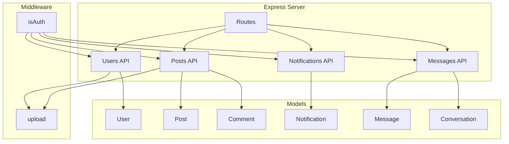

# Scrolla Backend Implementation Plan

## Overview
This document outlines the backend implementation plan for adding social media features to the existing Scrolla e-commerce backend.

## Architecture Diagram



## 1. Data Models

### 1.1 Post Model (`models/Post.js`)
```javascript
import mongoose from "mongoose";

const PostSchema = new mongoose.Schema({
  author: { type: mongoose.Schema.Types.ObjectId, ref: "User", required: true },
  content: { type: String, required: true, maxLength: 500 },
  imageUrl: { type: String },
  likes: [{ type: mongoose.Schema.Types.ObjectId, ref: "User" }],
  comments: [{ type: mongoose.Schema.Types.ObjectId, ref: "Comment" }],
  createdAt: { type: Date, default: Date.now },
  updatedAt: { type: Date, default: Date.now }
});

// Update timestamp on save
PostSchema.pre("save", function(next) {
  this.updatedAt = Date.now();
  next();
});

// Index for feed queries
PostSchema.index({ createdAt: -1 });
PostSchema.index({ author: 1, createdAt: -1 });

export default mongoose.model("Post", PostSchema);
```

### 1.2 Comment Model (`models/Comment.js`)
```javascript
import mongoose from "mongoose";

const CommentSchema = new mongoose.Schema({
  postId: { type: mongoose.Schema.Types.ObjectId, ref: "Post", required: true },
  author: { type: mongoose.Schema.Types.ObjectId, ref: "User", required: true },
  content: { type: String, required: true, maxLength: 500 },
  imageUrl: { type: String },
  createdAt: { type: Date, default: Date.now }
});

// Index for post comments query
CommentSchema.index({ postId: 1, createdAt: -1 });

export default mongoose.model("Comment", CommentSchema);
```

### 1.3 Notification Model (`models/Notification.js`)
```javascript
import mongoose from "mongoose";

const NotificationSchema = new mongoose.Schema({
  recipient: { type: mongoose.Schema.Types.ObjectId, ref: "User", required: true },
  sender: { type: mongoose.Schema.Types.ObjectId, ref: "User", required: true },
  type: { 
    type: String, 
    enum: ["like", "comment", "subscribe"], 
    required: true 
  },
  postId: { type: mongoose.Schema.Types.ObjectId, ref: "Post" },
  read: { type: Boolean, default: false },
  createdAt: { type: Date, default: Date.now }
});

// Index for user notifications
NotificationSchema.index({ recipient: 1, createdAt: -1 });
NotificationSchema.index({ recipient: 1, read: 1 });

export default mongoose.model("Notification", NotificationSchema);
```

### 1.4 Conversation Model (`models/Conversation.js`)
```javascript
import mongoose from "mongoose";

const ConversationSchema = new mongoose.Schema({
  participants: [{ type: mongoose.Schema.Types.ObjectId, ref: "User" }],
  lastMessage: { type: mongoose.Schema.Types.ObjectId, ref: "Message" },
  lastMessageAt: { type: Date, default: Date.now },
  createdAt: { type: Date, default: Date.now }
});

// Ensure unique pair of participants
ConversationSchema.index({ participants: 1 }, { unique: true });

export default mongoose.model("Conversation", ConversationSchema);
```

### 1.5 Updated User Schema Fields
Add to existing `models/User.js`:
```javascript
// Add these fields to UserSchema
displayName: { type: String },
location: { type: String },
website: { type: String },
banner: { type: String, default: "/default-banner.png" },
subscribers: [{ type: mongoose.Schema.Types.ObjectId, ref: "User" }],
subscribing: [{ type: mongoose.Schema.Types.ObjectId, ref: "User" }]
```

## 2. API Endpoints

### 2.1 Posts API (`/api/posts`)

| Method | Endpoint | Description | Auth Required |
|--------|----------|-------------|---------------|
| GET | `/api/posts?page=1&limit=20` | Get feed posts (paginated) | Yes |
| POST | `/api/posts` | Create new post | Yes |
| GET | `/api/posts/:id` | Get single post | Yes |
| DELETE | `/api/posts/:id` | Delete post | Yes (owner only) |
| POST | `/api/posts/:id/like` | Like/unlike post | Yes |
| POST | `/api/posts/:id/comment` | Add comment | Yes |
| GET | `/api/posts/:id/comments` | Get comments | Yes |
| DELETE | `/api/posts/:id/comment/:commentId` | Delete comment | Yes (owner only) |
| POST | `/api/posts/upload` | Upload post image | Yes |
| GET | `/api/posts/search?q=...` | Search posts | Yes |
| GET | `/api/users/:id/posts` | Get user's posts | Yes |

### 2.2 Users API (`/api/users`)

| Method | Endpoint | Description | Auth Required |
|--------|----------|-------------|---------------|
| GET | `/api/users/:id/profile` | Get user profile | Yes |
| PATCH | `/api/users/me` | Update profile | Yes |
| PATCH | `/api/users/me/avatar` | Upload avatar | Yes |
| PATCH | `/api/users/me/banner` | Upload banner | Yes |
| POST | `/api/users/:id/subscribe` | Subscribe to user | Yes |
| DELETE | `/api/users/:id/subscribe` | Unsubscribe | Yes |
| GET | `/api/users/:id/subscribers` | Get followers list | Yes |
| GET | `/api/users/:id/subscribing` | Get following list | Yes |

### 2.3 Notifications API (`/api/notifications`)

| Method | Endpoint | Description | Auth Required |
|--------|----------|-------------|---------------|
| GET | `/api/notifications` | Get user notifications | Yes |
| PATCH | `/api/notifications/:id/read` | Mark as read | Yes |
| POST | `/api/notifications/read-all` | Mark all as read | Yes |

### 2.4 Messages API (`/api/messages`)

| Method | Endpoint | Description | Auth Required |
|--------|----------|-------------|---------------|
| GET | `/api/messages/conversations` | Get all conversations | Yes |
| GET | `/api/messages/:conversationId` | Get messages in conversation | Yes |
| POST | `/api/messages/:conversationId` | Send message | Yes |

## 3. Controllers

### 3.1 Posts Controller (`controllers/postsController.js`)

**Key Functions:**
- `getFeedPosts(req, res)` - Returns paginated posts from subscribed users
- `createPost(req, res)` - Creates new post with optional image
- `getPost(req, res)` - Returns single post with populated author
- `deletePost(req, res)` - Deletes post (owner or admin only)
- `toggleLike(req, res)` - Adds/removes like, creates notification
- `addComment(req, res)` - Adds comment, creates notification
- `getComments(req, res)` - Returns paginated comments
- `deleteComment(req, res)` - Deletes comment (owner or admin only)
- `searchPosts(req, res)` - Searches posts by content

### 3.2 Users Controller (`controllers/usersController.js`)

**Key Functions:**
- `getUserProfile(req, res)` - Returns user with subscriber counts
- `updateProfile(req, res)` - Updates profile fields
- `uploadAvatar(req, res)` - Uploads user avatar
- `uploadBanner(req, res)` - Uploads user banner
- `subscribe(req, res)` - Subscribes to user, creates notification
- `unsubscribe(req, res)` - Unsubscribes from user
- `getSubscribers(req, res)` - Returns followers list
- `getSubscribing(req, res)` - Returns following list
- `getUserPosts(req, res)` - Returns user's posts

### 3.3 Notifications Controller (`controllers/notificationsController.js`)

**Key Functions:**
- `getNotifications(req, res)` - Returns user's notifications
- `markAsRead(req, res)` - Marks single notification as read
- `markAllAsRead(req, res)` - Marks all notifications as read

### 3.4 Messages Controller (`controllers/messagesController.js`)

**Key Functions:**
- `getConversations(req, res)` - Returns all conversations
- `getMessages(req, res)` - Returns messages in conversation
- `sendMessage(req, res)` - Creates message and updates conversation

## 4. Response Formats

### 4.1 Feed Response
```json
{
  "posts": [
    {
      "_id": "...",
      "content": "Hello world!",
      "imageUrl": "https://...",
      "likesCount": 10,
      "commentsCount": 5,
      "likedByCurrentUser": false,
      "author": {
        "_id": "...",
        "username": "johndoe",
        "displayName": "John Doe",
        "avatar": "https://..."
      },
      "createdAt": "2024-01-01T00:00:00.000Z"
    }
  ],
  "page": 1,
  "hasMore": true
}
```

### 4.2 Notification Response
```json
{
  "notifications": [
    {
      "_id": "...",
      "type": "like",
      "fromUser": {
        "_id": "...",
        "username": "janedoe",
        "displayName": "Jane Doe",
        "avatar": "https://..."
      },
      "postId": "...",
      "content": "liked your post",
      "read": false,
      "createdAt": "2024-01-01T00:00:00.000Z"
    }
  ],
  "unreadCount": 3
}
```

### 4.3 User Profile Response
```json
{
  "user": {
    "_id": "...",
    "username": "johndoe",
    "displayName": "John Doe",
    "bio": "...",
    "location": "...",
    "website": "...",
    "avatar": "https://...",
    "banner": "https://...",
    "subscribersCount": 100,
    "subscribingCount": 50,
    "isSubscribed": false
  }
}
```

## 5. File Structure Changes

```
models/
├── User.js (updated)
├── Post.js (new)
├── Comment.js (new)
├── Notification.js (new)
├── Conversation.js (new)
└── Message.js (existing)

controllers/
├── postsController.js (new)
├── usersController.js (new)
├── notificationsController.js (new)
├── messagesController.js (new)
└── productActionsController.js (existing)

routes/
├── posts.js (new)
├── notifications.js (new)
├── messages.js (updated)
└── users.js (updated)

server.js (updated)
```

## 6. Implementation Order

1. **Phase 1: Core Models**
   - Create Post, Comment, Notification, Conversation models
   - Update User schema

2. **Phase 2: Posts API**
   - Implement posts controller
   - Create posts routes
   - Add image upload endpoint

3. **Phase 3: Users API (Social)**
   - Implement social features in users controller
   - Update users routes
   - Add avatar/banner upload

4. **Phase 4: Notifications API**
   - Implement notifications controller
   - Create notifications routes

5. **Phase 5: Messages API**
   - Implement conversations model
   - Update messages controller
   - Update messages routes

6. **Phase 6: Integration**
   - Update server.js
   - Add new routes
   - Test all endpoints

## 7. Testing Strategy

### Unit Tests (Jest)
- Model validation tests
- Controller function tests
- Middleware tests

### Integration Tests (Supertest)
- API endpoint tests
- Authentication tests
- Error handling tests

## 8. Error Handling

Standard error response format:
```json
{
  "message": "Error description",
  "error": "Additional error details (dev only)"
}
```

HTTP Status Codes:
- 200: Success
- 201: Created
- 400: Bad Request
- 401: Not Authenticated
- 403: Not Authorized
- 404: Not Found
- 500: Server Error

## 9. Security Considerations

- All endpoints (except GET) require authentication
- Image upload validation (file type, size limit)
- Content sanitization for posts/comments
- Rate limiting on sensitive endpoints
- XSS protection for user-generated content
